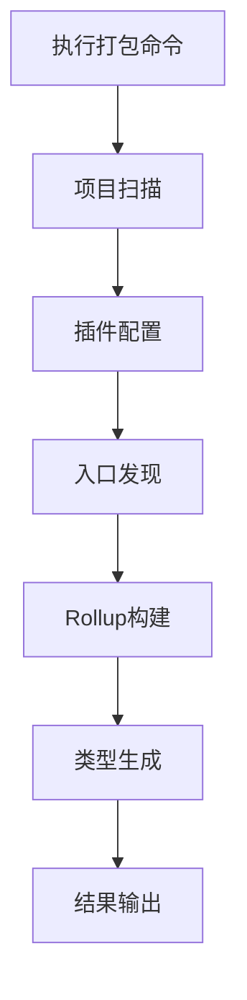

# 智能前端库打包工具产品需求文档

## 1. 产品概述

本产品是一个基于Rollup JavaScript API的智能前端库打包工具，旨在为前端开发者提供零配置、多格式输出的库打包解决方案。

该工具通过自动扫描项目文件类型，智能配置相应的Rollup插件，支持TypeScript、Vue、React、Less等多种技术栈，一键生成ESM、CJS、IIFE、UMD四种模块格式，大幅简化前端库的构建和发布流程。

## 2. 核心功能

### 2.1 用户角色

| 角色 | 使用方式 | 核心权限 |
|------|----------|----------|
| 前端开发者 | npm安装使用 | 可使用所有打包功能，配置自定义选项 |
| 库维护者 | 集成到CI/CD | 可批量打包，自动化发布流程 |

### 2.2 功能模块

本智能打包工具包含以下核心页面和功能：

1. **CLI命令行界面**：提供简洁的命令行操作入口，支持配置参数传递
2. **配置管理界面**：智能检测项目配置，支持自定义打包选项
3. **构建执行界面**：实时显示打包进度，输出详细日志信息
4. **结果输出界面**：展示打包结果统计，文件大小分析

### 2.3 页面详情

| 页面名称 | 模块名称 | 功能描述 |
|----------|----------|----------|
| CLI命令行界面 | 命令解析器 | 解析用户输入的命令和参数，验证配置有效性 |
| CLI命令行界面 | 帮助系统 | 显示使用说明，提供配置示例和错误提示 |
| 配置管理界面 | 项目扫描器 | 自动扫描src目录，检测文件类型和项目结构 |
| 配置管理界面 | 插件配置器 | 根据文件类型智能配置Rollup插件（TypeScript、Less、Vue、JSX等） |
| 配置管理界面 | 入口管理器 | 自动发现多入口文件，支持手动指定入口配置 |
| 构建执行界面 | Rollup构建器 | 执行Rollup打包，生成ESM、CJS、IIFE、UMD四种格式 |
| 构建执行界面 | 类型生成器 | 自动生成TypeScript声明文件到/types目录 |
| 构建执行界面 | 进度监控器 | 实时显示构建进度，输出详细的构建日志 |
| 结果输出界面 | 文件分析器 | 分析输出文件大小，生成构建报告 |
| 结果输出界面 | 错误处理器 | 捕获并友好显示构建错误，提供解决建议 |

## 3. 核心流程

**主要用户操作流程：**

1. 开发者在项目根目录执行打包命令
2. 工具自动扫描src目录，检测项目类型和文件结构
3. 根据检测结果智能配置Rollup插件（TypeScript、Less、Vue、React等）
4. 自动发现多入口文件，生成对应的Rollup配置
5. 并行执行四种格式的打包任务（ESM、CJS、IIFE、UMD）
6. 生成TypeScript声明文件到/types目录
7. 输出构建结果和性能分析报告

## 4. 用户界面设计

### 4.1 设计风格

- **主色调**：蓝色系（#2563eb）和绿色系（#059669）
- **辅助色**：灰色系（#6b7280）和橙色警告（#ea580c）
- **字体**：等宽字体 Consolas, Monaco, 'Courier New'
- **布局风格**：命令行风格，简洁的文本输出界面
- **图标风格**：使用Unicode符号和ASCII艺术字

### 4.2 页面设计概览

| 页面名称 | 模块名称 | UI元素 |
|----------|----------|--------|
| CLI命令行界面 | 命令解析器 | 简洁的命令提示符，彩色的参数高亮显示 |
| CLI命令行界面 | 帮助系统 | 结构化的帮助文档，代码示例高亮 |
| 配置管理界面 | 项目扫描器 | 树形结构显示文件列表，文件类型图标标识 |
| 配置管理界面 | 插件配置器 | 表格形式显示插件配置状态，绿色✓表示已配置 |
| 构建执行界面 | Rollup构建器 | 进度条显示构建状态，实时滚动的构建日志 |
| 构建执行界面 | 类型生成器 | 蓝色信息提示，显示生成的声明文件路径 |
| 结果输出界面 | 文件分析器 | 表格显示文件大小统计，颜色编码表示文件大小等级 |
| 结果输出界面 | 错误处理器 | 红色错误信息，黄色警告提示，包含解决建议链接 |

### 4.3 响应性

本工具主要面向命令行环境，支持各种终端宽度自适应显示，确保在不同尺寸的终端窗口中都能正常显示构建信息和进度。