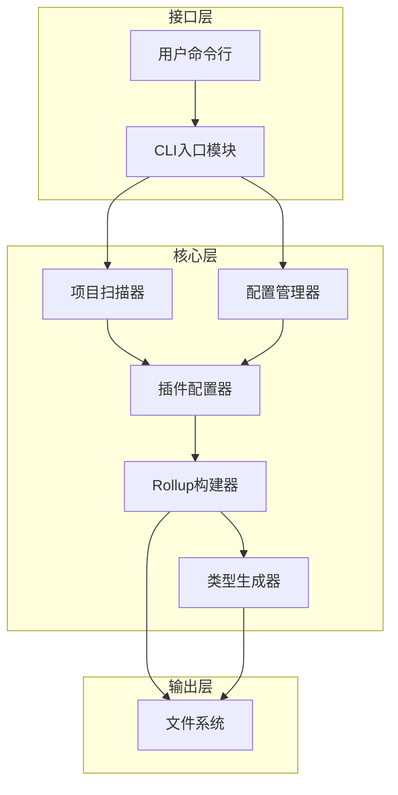
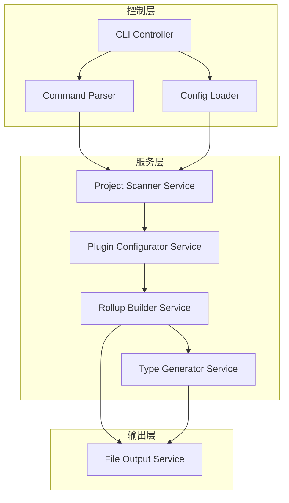
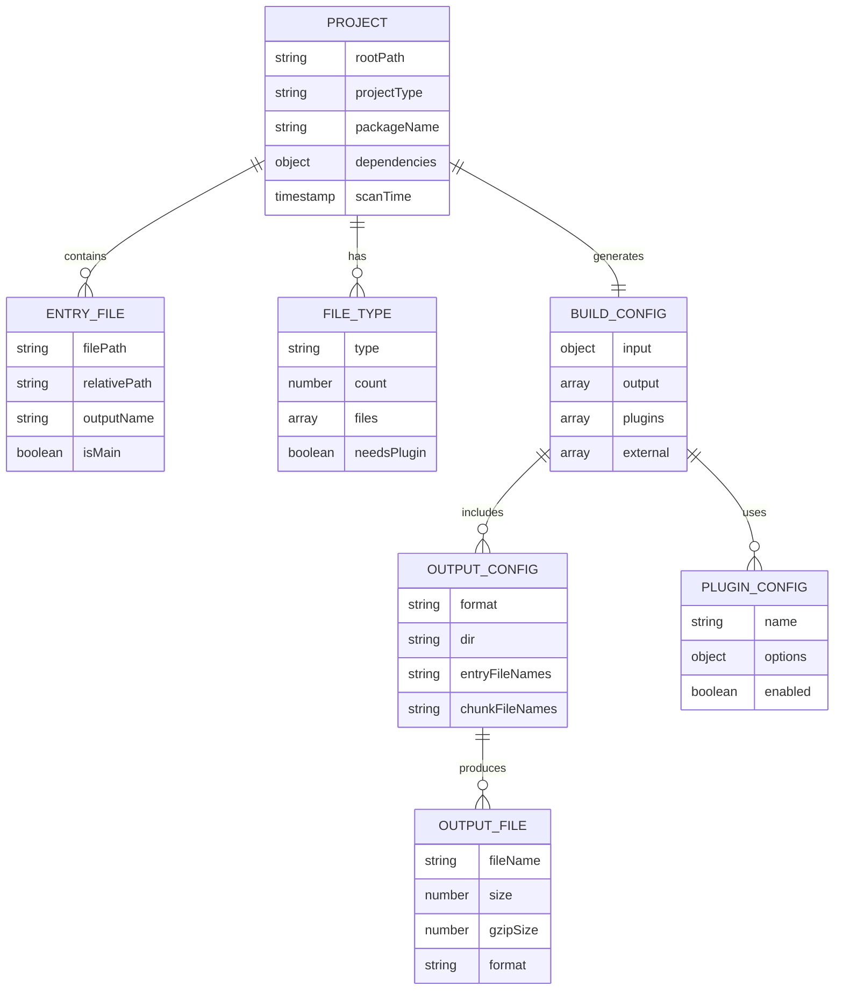

# 智能前端库打包工具技术架构文档

## 1. 架构设计



## 2. 技术描述

- 前端：Node.js CLI应用
- 核心框架：Rollup JavaScript API
- 构建工具：TypeScript + ESBuild
- 插件系统：动态插件加载机制
- 文件处理：Node.js fs模块 + glob模式匹配

## 3. 路由定义

| 命令 | 功能描述 |
|------|----------|
| `build` | 执行智能打包，自动扫描和配置 |
| `build --config <path>` | 使用指定配置文件进行打包 |
| `build --watch` | 监听模式，文件变化时自动重新打包 |
| `build --analyze` | 打包并生成bundle分析报告 |
| `init` | 初始化配置文件模板 |
| `--help` | 显示帮助信息和使用示例 |

## 4. API定义

### 4.1 核心API

**项目扫描API**
```typescript
interface ProjectScanner {
  scanProject(rootPath: string): Promise<ProjectInfo>
}

interface ProjectInfo {
  projectType: 'vue' | 'react' | 'vanilla' | 'library'
  entryFiles: string[]
  fileTypes: FileTypeInfo[]
  dependencies: Record<string, string>
}

interface FileTypeInfo {
  type: 'ts' | 'js' | 'vue' | 'jsx' | 'tsx' | 'less' | 'scss' | 'css'
  files: string[]
  count: number
}
```

**插件配置API**
```typescript
interface PluginConfigurator {
  configurePlugins(projectInfo: ProjectInfo): RollupPlugin[]
}

interface BuildConfig {
  input: Record<string, string>
  output: OutputConfig[]
  plugins: RollupPlugin[]
  external?: string[]
}

interface OutputConfig {
  format: 'es' | 'cjs' | 'iife' | 'umd'
  dir: string
  entryFileNames: string
  chunkFileNames?: string
}
```

**构建执行API**
```typescript
interface Builder {
  build(config: BuildConfig): Promise<BuildResult>
  watch(config: BuildConfig): Promise<RollupWatcher>
}

interface BuildResult {
  success: boolean
  outputs: OutputInfo[]
  duration: number
  errors?: BuildError[]
}

interface OutputInfo {
  format: string
  files: FileInfo[]
  size: number
}

interface FileInfo {
  fileName: string
  size: number
  gzipSize?: number
}
```

## 5. 服务架构图



## 6. 数据模型

### 6.1 数据模型定义



### 6.2 配置文件结构

**默认配置文件 (builder.config.js)**
```javascript
// 用户配置文件示例
export default {
  // 入口配置
  input: {
    // 自动扫描src目录，或手动指定
    auto: true,
    include: ['src/**/*.{ts,js,vue,jsx,tsx}'],
    exclude: ['**/*.test.*', '**/*.spec.*']
  },
  
  // 输出配置
  output: {
    formats: ['es', 'cjs', 'iife', 'umd'], // 默认四种格式
    dirs: {
      es: 'esm',
      cjs: 'cjs', 
      iife: 'lib',
      umd: 'dist'
    },
    types: 'types' // 类型声明文件目录
  },
  
  // 插件配置
  plugins: {
    typescript: { auto: true },
    vue: { auto: true },
    react: { auto: true },
    less: { auto: true }
  },
  
  // 外部依赖
  external: ['vue', 'react', 'lodash'],
  
  // 构建选项
  build: {
    minify: true,
    sourcemap: true,
    analyze: false
  }
}
```

**内部数据结构**
```typescript
// 项目扫描结果
interface ProjectScanResult {
  rootPath: string
  packageJson: PackageJson
  entryFiles: Map<string, string> // name -> path
  fileTypes: Set<FileType>
  dependencies: {
    production: string[]
    development: string[]
    peer: string[]
  }
}

// 插件配置映射
interface PluginConfigMap {
  typescript: () => Plugin
  vue: () => Plugin
  react: () => Plugin
  less: () => Plugin
  scss: () => Plugin
  postcss: () => Plugin
  babel: () => Plugin
  terser: () => Plugin
}

// 构建任务
interface BuildTask {
  id: string
  format: OutputFormat
  input: Record<string, string>
  output: OutputOptions
  plugins: Plugin[]
  external: string[]
}
```