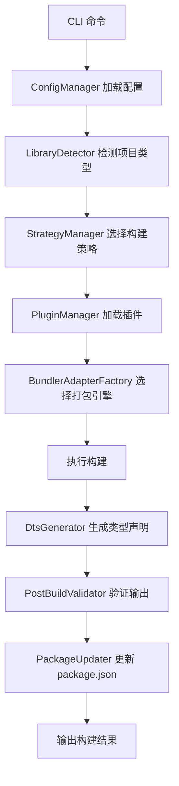

# @ldesign/builder 优化方案文档

> 版本：1.0.0
> 更新日期：2024-01
> 作者：LDesign Team

## 目录

- [一、概述](#一概述)
- [二、当前架构分析](#二当前架构分析)
- [三、功能完整性分析](#三功能完整性分析)
- [四、自动化程度分析](#四自动化程度分析)
- [五、性能优化分析](#五性能优化分析)
- [六、开发体验分析](#六开发体验分析)
- [七、扩展性分析](#七扩展性分析)
- [八、零配置实现路径](#八零配置实现路径)
- [九、具体改进方案](#九具体改进方案)
- [十、实施计划](#十实施计划)
- [附录](#附录)

---

## 一、概述

### 1.1 文档目的

本文档旨在对 `@ldesign/builder` 构建工具进行全面的技术分析，识别当前实现中的优势与不足，并提供详细的优化建议和实施路径。重点关注**零配置打包能力**的实现。

### 1.2 项目定位

`@ldesign/builder` 是一个智能的前端库打包工具，主要特点：

- 🎯 **零配置**：自动检测项目类型，无需手动配置
- 🚀 **多引擎**：支持 Rollup、Rolldown、ESBuild、SWC 四种打包引擎
- 🔍 **智能检测**：支持 13+ 前端框架的自动识别
- 📦 **多格式输出**：ESM、CJS、UMD、IIFE
- 🔧 **类型声明**：自动生成 TypeScript 声明文件

### 1.3 分析维度

| 维度 | 说明 |
|-----|------|
| 功能完整性 | 与主流工具对比，识别缺失功能 |
| 自动化程度 | 评估零配置能力，识别可自动推断的配置 |
| 性能优化 | 构建速度、缓存机制、并行处理 |
| 开发体验 | 错误提示、日志输出、调试支持 |
| 扩展性 | 插件系统、配置灵活性、Monorepo 支持 |

---

## 二、当前架构分析

### 2.1 核心模块结构

```
tools/builder/src/
├── adapters/           # 打包引擎适配器
│   ├── base/          # 适配器工厂
│   ├── rollup/        # Rollup 适配器
│   ├── rolldown/      # Rolldown 适配器
│   ├── esbuild/       # ESBuild 适配器
│   └── swc/           # SWC 适配器
├── cli/               # 命令行工具
│   └── commands/      # 命令实现
├── core/              # 核心模块
│   ├── LibraryBuilder.ts      # 主构建器
│   ├── LibraryDetector.ts     # 库类型检测
│   ├── StrategyManager.ts     # 策略管理
│   ├── PluginManager.ts       # 插件管理
│   ├── ConfigManager.ts       # 配置管理
│   └── PerformanceMonitor.ts  # 性能监控
├── detectors/         # 检测器
│   └── FrameworkDetector.ts   # 框架检测
├── generators/        # 生成器
│   └── DtsGenerator.ts        # 类型声明生成
├── strategies/        # 构建策略
│   ├── TypeScriptStrategy.ts
│   ├── Vue2Strategy.ts
│   ├── Vue3Strategy.ts
│   ├── ReactStrategy.ts
│   └── ...
├── plugins/           # 内置插件
├── presets/           # 预设配置
├── utils/             # 工具函数
│   ├── cache/         # 缓存系统
│   ├── parallel/      # 并行处理
│   ├── logger/        # 日志系统
│   └── error-handler/ # 错误处理
└── types/             # 类型定义
```

### 2.2 核心流程



### 2.3 支持的框架类型

| 框架 | LibraryType | 检测置信度 | 策略实现 |
|-----|-------------|-----------|---------|
| TypeScript | `typescript` | 1.0 | ✅ TypeScriptStrategy |
| Vue 2 | `vue2` | 0.95 | ✅ Vue2Strategy |
| Vue 3 | `vue3` | 0.95 | ✅ Vue3Strategy |
| React | `react` | 0.95 | ✅ ReactStrategy |
| Svelte | `svelte` | 0.95 | ✅ SvelteStrategy |
| Solid | `solid` | 0.90 | ✅ SolidStrategy |
| Preact | `preact` | 0.90 | ✅ PreactStrategy |
| Lit | `lit` | 0.85 | ✅ LitStrategy |
| Angular | `angular` | 0.80 | ✅ AngularStrategy |
| Qwik | `qwik` | 0.95 | ✅ QwikStrategy |
| Style | `style` | 0.30 | ✅ StyleStrategy |
| Mixed | `mixed` | 0.85 | ✅ MixedStrategy |

---

## 三、功能完整性分析

### 3.1 已实现功能清单

#### 核心构建功能

| 功能 | 状态 | 实现位置 | 完善度 |
|-----|------|---------|--------|
| 多格式输出 (ESM/CJS/UMD/IIFE) | ✅ | `adapters/` | ⭐⭐⭐⭐⭐ |
| TypeScript 编译 | ✅ | `strategies/TypeScriptStrategy.ts` | ⭐⭐⭐⭐⭐ |
| 类型声明生成 (.d.ts) | ✅ | `generators/DtsGenerator.ts` | ⭐⭐⭐⭐ |
| Source Map 生成 | ✅ | `adapters/` | ⭐⭐⭐⭐⭐ |
| 代码压缩 (Minify) | ✅ | `@rollup/plugin-terser` | ⭐⭐⭐⭐⭐ |
| Tree-shaking | ✅ | `optimizers/tree-shaking/` | ⭐⭐⭐⭐ |
| Code Splitting | ✅ | Rollup 内置 | ⭐⭐⭐⭐ |
| Banner/Footer 注入 | ✅ | `formatters/BannerGenerator.ts` | ⭐⭐⭐⭐ |

#### 样式处理

| 功能 | 状态 | 实现位置 | 完善度 |
|-----|------|---------|--------|
| CSS 处理 | ✅ | `rollup-plugin-postcss` | ⭐⭐⭐⭐ |
| Less 编译 | ✅ | `rollup-plugin-less` | ⭐⭐⭐⭐ |
| Sass/SCSS 编译 | ✅ | `rollup-plugin-sass` | ⭐⭐⭐⭐ |
| Stylus 编译 | ✅ | `rollup-plugin-stylus` | ⭐⭐⭐⭐ |
| PostCSS 处理 | ✅ | `postcss` | ⭐⭐⭐⭐ |
| CSS Modules | ⚠️ | 部分支持 | ⭐⭐⭐ |
| CSS-in-JS | ⚠️ | `plugins/css-in-js.ts` | ⭐⭐⭐ |

#### 框架支持

| 功能 | 状态 | 实现位置 | 完善度 |
|-----|------|---------|--------|
| Vue 2 SFC 编译 | ✅ | `@vitejs/plugin-vue2` | ⭐⭐⭐⭐ |
| Vue 3 SFC 编译 | ✅ | `@vitejs/plugin-vue` | ⭐⭐⭐⭐⭐ |
| Vue JSX 支持 | ✅ | `@vitejs/plugin-vue-jsx` | ⭐⭐⭐⭐ |
| React JSX 编译 | ✅ | `@vitejs/plugin-react` | ⭐⭐⭐⭐⭐ |
| Svelte 编译 | ✅ | `rollup-plugin-svelte` | ⭐⭐⭐⭐ |
| Solid JSX 编译 | ✅ | `babel-preset-solid` | ⭐⭐⭐⭐ |

#### 工具功能

| 功能 | 状态 | 实现位置 | 完善度 |
|-----|------|---------|--------|
| 性能监控 | ✅ | `core/PerformanceMonitor.ts` | ⭐⭐⭐⭐ |
| 多级缓存 | ✅ | `utils/cache/` | ⭐⭐⭐⭐ |
| 增量编译 | ✅ | `DtsGenerator` | ⭐⭐⭐⭐ |
| Watch 模式 | ✅ | `cli/commands/watch.ts` | ⭐⭐⭐ |
| 构建分析 | ✅ | `cli/commands/analyze.ts` | ⭐⭐⭐ |
| 配置校验 | ✅ | `utils/validation/` | ⭐⭐⭐⭐ |

### 3.2 缺失功能识别

#### 🔴 高优先级缺失

| 功能 | 说明 | 主流工具对比 |
|-----|------|-------------|
| **Polyfill 注入** | 缺少 core-js 自动注入 | Vite/tsup 支持 |
| **Bundle Analyzer 可视化** | 只有文本报告，缺少 HTML 图表 | rollup-plugin-visualizer |
| **Stub 模式** | 开发时直接引用源码 | unbuild 特有 |
| **HMR 开发服务器** | 库开发场景可选 | Vite 支持 |

#### 🟡 中优先级缺失

| 功能 | 说明 | 主流工具对比 |
|-----|------|-------------|
| **License 聚合** | 第三方依赖许可证提取 | rollup-plugin-license |
| **条件编译** | `__DEV__`/`__PROD__` 等环境变量 | 部分支持 |
| **资源内联** | 小资源自动 Base64 内联 | Vite 支持 |
| **构建历史对比** | 性能数据持久化和对比 | 无 |

#### 🟢 低优先级缺失

| 功能 | 说明 | 主流工具对比 |
|-----|------|-------------|
| **JSON Schema 配置** | 配置文件智能提示 | tsup 支持 |
| **远程缓存** | 团队共享构建缓存 | Nx/Turborepo |
| **构建通知** | 系统级构建完成通知 | 可选功能 |

### 3.3 与主流工具对比

| 特性 | @ldesign/builder | Vite | tsup | unbuild | Rollup |
|-----|-----------------|------|------|---------|--------|
| 零配置程度 | ⭐⭐⭐⭐ | ⭐⭐⭐⭐⭐ | ⭐⭐⭐⭐⭐ | ⭐⭐⭐⭐⭐ | ⭐⭐ |
| 多框架支持 | ⭐⭐⭐⭐⭐ | ⭐⭐⭐⭐ | ⭐⭐⭐ | ⭐⭐⭐ | ⭐⭐ |
| 多引擎支持 | ⭐⭐⭐⭐⭐ | ⭐⭐⭐ | ⭐⭐⭐⭐ | ⭐⭐⭐ | ⭐ |
| 类型声明 | ⭐⭐⭐⭐ | ⭐⭐⭐ | ⭐⭐⭐⭐⭐ | ⭐⭐⭐⭐⭐ | ⭐⭐ |
| 构建速度 | ⭐⭐⭐⭐ | ⭐⭐⭐⭐⭐ | ⭐⭐⭐⭐⭐ | ⭐⭐⭐⭐ | ⭐⭐⭐ |
| Monorepo | ⭐⭐⭐⭐ | ⭐⭐⭐ | ⭐⭐⭐ | ⭐⭐⭐⭐⭐ | ⭐⭐ |
| 插件生态 | ⭐⭐⭐ | ⭐⭐⭐⭐⭐ | ⭐⭐⭐ | ⭐⭐⭐ | ⭐⭐⭐⭐⭐ |
| Stub 模式 | ❌ | ❌ | ❌ | ⭐⭐⭐⭐⭐ | ❌ |

**@ldesign/builder 的独特优势：**

1. **最全面的框架检测** - 支持 13+ 框架自动识别
2. **四引擎智能选择** - 根据项目特征自动选择最佳引擎
3. **完善的性能监控** - 内置构建性能分析
4. **丰富的预设配置** - 7 种开箱即用的预设


---

## 四、自动化程度分析

### 4.1 当前自动化能力

#### ✅ 已实现的自动化

| 自动化项 | 实现方式 | 可靠性 |
|---------|---------|--------|
| **框架类型检测** | `LibraryDetector` 多层检测 | ⭐⭐⭐⭐⭐ |
| **入口文件发现** | 固定模式匹配 | ⭐⭐⭐ |
| **依赖外部化** | 读取 package.json | ⭐⭐⭐⭐ |
| **输出格式选择** | 根据 `type` 字段 | ⭐⭐⭐⭐ |
| **打包引擎选择** | `selectBestAdapter()` | ⭐⭐⭐⭐ |
| **package.json 更新** | `PackageUpdater` | ⭐⭐⭐⭐ |

#### 框架检测机制详解

```typescript
// LibraryDetector 检测流程
async detect(projectPath: string): Promise<LibraryDetectionResult> {
  // 1. 快速路径检测 (Fast-path)
  //    - Solid: .tsx/.jsx + solid-js 依赖
  //    - Svelte: .svelte 文件
  //    - Vue: .vue 文件 + 版本检测

  // 2. 混合框架检测 (Monorepo)
  //    - 多框架共存时返回 ENHANCED_MIXED

  // 3. 评分系统 (Scoring)
  //    - 文件模式权重: 0.4
  //    - 依赖权重: 0.3
  //    - 配置文件权重: 0.2
  //    - package.json 字段权重: 0.1

  // 4. 置信度阈值: 0.6
}
```

### 4.2 需要增强的自动化

#### 🔴 P0 - 入口文件智能检测

**当前问题：**
```typescript
// 当前实现 - 固定模式匹配
const ENTRY_PATTERNS = [
  'src/index.ts',
  'src/index.tsx',
  'src/main.ts',
  'lib/index.ts',
  'index.ts'
]
```

**改进方案：**
```typescript
/**
 * 智能入口检测器
 * 优先级：exports > main/module > 文件名推断 > 模式匹配
 */
async detectEntryPoint(projectPath: string): Promise<string> {
  const pkg = await this.readPackageJson(projectPath)

  // 1. 从 exports 字段反向推断
  if (pkg.exports?.['.']) {
    const exportEntry = pkg.exports['.']
    const importPath = typeof exportEntry === 'string'
      ? exportEntry
      : exportEntry.import || exportEntry.default

    if (importPath) {
      const srcPath = this.inferSourcePath(importPath)
      // dist/index.js -> src/index.ts
      if (await this.fileExists(path.join(projectPath, srcPath))) {
        return srcPath
      }
    }
  }

  // 2. 从 main/module 字段推断
  const mainField = pkg.module || pkg.main
  if (mainField) {
    const srcPath = this.inferSourcePath(mainField)
    if (await this.fileExists(path.join(projectPath, srcPath))) {
      return srcPath
    }
  }

  // 3. 根据项目名推断
  const projectName = pkg.name?.split('/').pop()
  if (projectName) {
    const namedEntry = `src/${projectName}.ts`
    if (await this.fileExists(path.join(projectPath, namedEntry))) {
      return namedEntry
    }
  }

  // 4. 回退到模式匹配
  return this.findByPatterns(projectPath, ENTRY_PATTERNS)
}

/**
 * 从输出路径推断源文件路径
 */
private inferSourcePath(outputPath: string): string {
  return outputPath
    .replace(/^\.\//, '')
    .replace(/^dist\//, 'src/')
    .replace(/^es\//, 'src/')
    .replace(/^lib\//, 'src/')
    .replace(/\.js$/, '.ts')
    .replace(/\.mjs$/, '.ts')
    .replace(/\.cjs$/, '.ts')
}
```

#### 🔴 P0 - 目标环境自动推断

**当前问题：**
- `target` 配置需要手动指定
- 未读取 `engines` 和 `browserslist`

**改进方案：**
```typescript
/**
 * 目标环境自动推断
 */
async inferTarget(projectPath: string): Promise<string[]> {
  const pkg = await this.readPackageJson(projectPath)

  // 1. 从 engines.node 推断 Node.js 版本
  if (pkg.engines?.node) {
    const nodeVersion = this.parseNodeVersion(pkg.engines.node)
    if (nodeVersion) {
      return [`node${nodeVersion}`]
    }
  }

  // 2. 读取 browserslist 配置
  const browserslistConfig = await this.loadBrowserslist(projectPath)
  if (browserslistConfig) {
    return this.convertBrowserslistToTargets(browserslistConfig)
  }

  // 3. 根据库类型推断
  if (pkg.type === 'module') {
    return ['es2020']  // ESM 项目默认 ES2020
  }

  // 4. 默认值
  return ['es2018']
}

/**
 * 解析 Node 版本要求
 * @example ">=16.0.0" -> 16
 */
private parseNodeVersion(engines: string): number | null {
  const match = engines.match(/>=?\s*(\d+)/)
  return match ? parseInt(match[1], 10) : null
}

/**
 * 将 browserslist 转换为构建目标
 */
private convertBrowserslistToTargets(config: string[]): string[] {
  // 使用 browserslist 解析，返回对应的 esbuild/rollup target
  const targets = browserslist(config)
  // 分析最低支持版本...
  return ['chrome80', 'firefox78', 'safari14']
}
```

#### 🔴 P0 - 外部依赖智能分析

**当前问题：**
- 简单读取 `dependencies`/`peerDependencies`
- 未区分运行时依赖和构建时依赖

**改进方案：**
```typescript
/**
 * 智能外部依赖分析
 */
async analyzeExternals(
  entryFiles: string[],
  projectPath: string
): Promise<ExternalConfig> {
  const pkg = await this.readPackageJson(projectPath)
  const imports = await this.collectAllImports(entryFiles)

  // 分类依赖
  const result: ExternalConfig = {
    // 运行时依赖 - 必须外部化
    runtime: [],
    // 开发依赖 - 可以打包（如 lodash-es 的部分函数）
    bundleable: [],
    // 对等依赖 - 必须外部化
    peer: Object.keys(pkg.peerDependencies || {}),
    // 可选依赖 - 条件外部化
    optional: Object.keys(pkg.optionalDependencies || {})
  }

  // 分析每个导入
  for (const importPath of imports) {
    const pkgName = this.extractPackageName(importPath)

    if (pkg.dependencies?.[pkgName]) {
      // 检查是否在运行时被使用
      if (this.isRuntimeDependency(importPath, entryFiles)) {
        result.runtime.push(pkgName)
      } else {
        result.bundleable.push(pkgName)
      }
    }
  }

  return result
}

/**
 * 检查是否为运行时依赖
 * - 被导出的模块使用 -> 运行时
 * - 仅在构建脚本中使用 -> 构建时
 */
private isRuntimeDependency(
  importPath: string,
  entryFiles: string[]
): boolean {
  // 分析 import 是否出现在导出链中
  // ...
}
```

#### 🟡 P1 - TypeScript 配置自动继承

**改进方案：**
```typescript
/**
 * 自动继承 tsconfig.json 配置
 */
async loadTsConfig(projectPath: string): Promise<TsConfigOptions> {
  const tsconfigPath = path.join(projectPath, 'tsconfig.json')

  if (await this.fileExists(tsconfigPath)) {
    const tsconfig = await this.readJson(tsconfigPath)

    return {
      target: tsconfig.compilerOptions?.target || 'ES2020',
      module: tsconfig.compilerOptions?.module || 'ESNext',
      moduleResolution: tsconfig.compilerOptions?.moduleResolution || 'bundler',
      strict: tsconfig.compilerOptions?.strict ?? true,
      declaration: tsconfig.compilerOptions?.declaration ?? true,
      declarationMap: tsconfig.compilerOptions?.declarationMap ?? false,
      paths: tsconfig.compilerOptions?.paths,
      baseUrl: tsconfig.compilerOptions?.baseUrl
    }
  }

  return this.getDefaultTsConfig()
}
```

#### 🟡 P1 - CSS Modules 自动检测

**改进方案：**
```typescript
/**
 * 根据文件命名自动启用 CSS Modules
 */
function shouldUseCssModules(filePath: string): boolean {
  // *.module.css / *.module.scss / *.module.less
  return /\.module\.(css|scss|sass|less|styl)$/.test(filePath)
}

// 在 PostCSS 插件配置中
{
  modules: {
    auto: shouldUseCssModules,
    generateScopedName: '[name]__[local]___[hash:base64:5]'
  }
}
```

### 4.3 自动化能力评估矩阵

| 配置项 | 当前状态 | 目标状态 | 优先级 |
|-------|---------|---------|--------|
| 框架类型 | ✅ 自动 | ✅ 自动 | - |
| 入口文件 | ⚠️ 模式匹配 | ✅ 智能推断 | P0 |
| 输出目录 | ⚠️ 默认 dist | ✅ 根据 exports | P1 |
| 输出格式 | ⚠️ 需配置 | ✅ 根据 pkg 推断 | P0 |
| 目标环境 | ❌ 需配置 | ✅ 读取 engines | P0 |
| 外部依赖 | ⚠️ 简单读取 | ✅ 智能分析 | P0 |
| TypeScript | ⚠️ 部分 | ✅ 继承 tsconfig | P1 |
| CSS Modules | ❌ 需配置 | ✅ 自动检测 | P2 |
| Sourcemap | ⚠️ 默认 true | ✅ 按环境 | P2 |
| Minify | ⚠️ 默认 false | ✅ 按环境 | P2 |


---

## 五、性能优化分析

### 5.1 当前性能特性

#### 已实现的优化

| 优化项 | 实现位置 | 效果评估 |
|-------|---------|---------|
| **多级缓存** | `utils/cache/MultiLevelCache.ts` | ⭐⭐⭐⭐ |
| **内存缓存** | `utils/cache/MemoryCache.ts` | ⭐⭐⭐⭐⭐ |
| **文件系统缓存** | `utils/cache/FileSystemCache.ts` | ⭐⭐⭐⭐ |
| **增量编译 (DTS)** | `generators/DtsGenerator.ts` | ⭐⭐⭐⭐ |
| **并行处理** | `utils/parallel/WorkerPool.ts` | ⭐⭐⭐ |
| **性能监控** | `core/PerformanceMonitor.ts` | ⭐⭐⭐⭐ |
| **多引擎选择** | `adapters/base/AdapterFactory.ts` | ⭐⭐⭐⭐⭐ |

#### 缓存系统架构

```
┌─────────────────────────────────────────────────┐
│                 MultiLevelCache                  │
├─────────────────────────────────────────────────┤
│  Level 1: MemoryCache (最快, 容量有限)           │
│     ↓ miss                                       │
│  Level 2: FileSystemCache (较快, 持久化)         │
│     ↓ miss                                       │
│  Level 3: RemoteCache (可选, 团队共享)           │
└─────────────────────────────────────────────────┘
```

### 5.2 性能瓶颈分析

#### 🔴 瓶颈 1: 多格式串行构建

**当前问题：**
```typescript
// 当前实现 - 串行构建多种格式
for (const format of ['esm', 'cjs', 'umd']) {
  await this.buildFormat(format)  // 串行等待
}
```

**优化方案：**
```typescript
/**
 * 并行构建多种格式
 */
async buildAllFormats(config: BuilderConfig): Promise<BuildResult[]> {
  const formats = Array.isArray(config.output?.format)
    ? config.output.format
    : [config.output?.format || 'esm']

  // 并行构建（格式之间无依赖）
  if (formats.length > 1 && config.parallel !== false) {
    const results = await Promise.all(
      formats.map(format =>
        this.buildSingleFormat({
          ...config,
          output: { ...config.output, format }
        })
      )
    )
    return this.mergeResults(results)
  }

  // 单格式或禁用并行
  return [await this.buildSingleFormat(config)]
}
```

**预期效果：** 多格式构建速度提升 2-3 倍

#### 🔴 瓶颈 2: DTS 与 JS 串行生成

**当前问题：**
```typescript
// 当前实现
const jsResult = await this.buildJs(config)
const dtsResult = await this.generateDts(config)  // 等待 JS 完成
```

**优化方案：**
```typescript
/**
 * JS 构建与 DTS 生成并行
 */
async build(config: BuilderConfig): Promise<BuildResult> {
  // 并行执行（两者互不依赖）
  const [jsResult, dtsResult] = await Promise.all([
    this.buildJs(config),
    config.dts !== false ? this.generateDts(config) : null
  ])

  return this.mergeResults(jsResult, dtsResult)
}
```

**预期效果：** 整体构建时间减少 30-40%

#### 🟡 瓶颈 3: 插件启动时全量加载

**当前问题：**
- 所有插件在初始化时加载
- 未使用的插件也占用内存

**优化方案：**
```typescript
/**
 * 插件懒加载
 */
class LazyPluginManager {
  private pluginFactories: Map<string, () => Promise<Plugin>> = new Map()
  private loadedPlugins: Map<string, Plugin> = new Map()

  /**
   * 注册插件工厂（不立即加载）
   */
  register(name: string, factory: () => Promise<Plugin>): void {
    this.pluginFactories.set(name, factory)
  }

  /**
   * 按需加载插件
   */
  async get(name: string): Promise<Plugin | null> {
    // 已加载直接返回
    if (this.loadedPlugins.has(name)) {
      return this.loadedPlugins.get(name)!
    }

    // 懒加载
    const factory = this.pluginFactories.get(name)
    if (factory) {
      const plugin = await factory()
      this.loadedPlugins.set(name, plugin)
      return plugin
    }

    return null
  }

  /**
   * 只加载需要的插件
   */
  async loadRequired(config: BuilderConfig): Promise<Plugin[]> {
    const required = this.analyzeRequiredPlugins(config)
    return Promise.all(required.map(name => this.get(name)))
  }
}
```

#### 🟡 瓶颈 4: 缓存命中率不足

**当前问题：**
- 缓存 key 生成策略可能导致频繁失效
- 缺少缓存预热机制

**优化方案：**
```typescript
/**
 * 优化缓存 key 生成
 */
class SmartCacheKeyGenerator {
  /**
   * 基于内容 hash 而非时间戳
   */
  async generateKey(filePath: string): Promise<string> {
    const content = await fs.readFile(filePath, 'utf-8')
    const contentHash = crypto
      .createHash('xxhash64')  // 更快的 hash 算法
      .update(content)
      .digest('hex')

    // 包含依赖版本信息
    const depsHash = await this.getDependenciesHash(filePath)

    return `${path.basename(filePath)}-${contentHash}-${depsHash}`
  }

  /**
   * 缓存预热 - 在 watch 模式下预先计算
   */
  async warmup(files: string[]): Promise<void> {
    await Promise.all(
      files.map(file => this.generateKey(file))
    )
  }
}
```

### 5.3 性能监控增强

**当前实现分析：**

`PerformanceMonitor` 已经提供了基础的性能监控，但可以增强：

```typescript
/**
 * 增强的性能监控
 */
class EnhancedPerformanceMonitor extends PerformanceMonitor {
  /**
   * 识别性能瓶颈
   */
  identifyBottlenecks(): BottleneckReport {
    const metrics = this.getMetrics()

    return {
      // 慢模块分析
      slowModules: this.findSlowModules(metrics),
      // 大文件警告
      largeFiles: this.findLargeFiles(metrics),
      // 循环依赖检测
      circularDeps: this.detectCircularDependencies(),
      // 重复依赖检测
      duplicateDeps: this.detectDuplicateDependencies(),
      // 优化建议
      suggestions: this.generateSuggestions(metrics)
    }
  }

  /**
   * 生成性能报告
   */
  generateReport(): PerformanceReport {
    return {
      summary: {
        totalTime: this.getTotalTime(),
        jsTime: this.getPhaseTime('js'),
        dtsTime: this.getPhaseTime('dts'),
        pluginsTime: this.getPhaseTime('plugins')
      },
      phases: this.getPhaseBreakdown(),
      memory: this.getMemoryUsage(),
      cache: this.getCacheStats(),
      bottlenecks: this.identifyBottlenecks()
    }
  }
}
```

### 5.4 性能优化路线图

```
Phase 1 (1 周): 并行构建
├── 多格式并行输出
├── JS/DTS 并行生成
└── 预期提升: 40-50%

Phase 2 (1 周): 缓存优化
├── 内容 hash 缓存 key
├── 缓存预热机制
└── 预期提升: 20-30% (重复构建)

Phase 3 (2 周): 插件优化
├── 插件懒加载
├── 插件执行并行化
└── 预期提升: 10-20%

Phase 4 (持续): 监控增强
├── 瓶颈自动识别
├── 优化建议生成
└── 构建历史对比
```


---

## 六、开发体验分析

### 6.1 当前开发体验特性

| 特性 | 实现位置 | 完善度 |
|-----|---------|--------|
| **多级日志** | `utils/logger/Logger.ts` | ⭐⭐⭐⭐ |
| **彩色输出** | chalk 集成 | ⭐⭐⭐⭐⭐ |
| **错误码系统** | `constants/errors.ts` | ⭐⭐⭐⭐ |
| **错误建议** | `BuilderError.suggestion` | ⭐⭐⭐⭐ |
| **进度提示** | ora 集成 | ⭐⭐⭐ |
| **构建摘要** | `logger-build-summary.ts` | ⭐⭐⭐⭐ |

### 6.2 需要改进的体验

#### 🔴 改进 1: 增强错误提示

**当前问题：**
- 错误信息缺少文档链接
- 复杂错误缺少详细上下文

**改进方案：**
```typescript
// constants/errors.ts 增强
export const ERROR_DOCS: Record<ErrorCode, string> = {
  [ErrorCode.BUILD_FAILED]: 'https://ldesign.dev/builder/errors/build-failed',
  [ErrorCode.CONFIG_INVALID]: 'https://ldesign.dev/builder/errors/config-invalid',
  [ErrorCode.ENTRY_NOT_FOUND]: 'https://ldesign.dev/builder/errors/entry-not-found',
  [ErrorCode.TYPESCRIPT_ERROR]: 'https://ldesign.dev/builder/errors/typescript',
  // ...
}

// BuilderError 增强
export class BuilderError extends Error {
  getFullMessage(): string {
    let message = `[${this.code}] ${this.message}`

    if (this.phase) {
      message += `\n📍 阶段: ${this.phase}`
    }
    if (this.file) {
      message += `\n📄 文件: ${this.file}`
    }
    if (this.suggestion) {
      message += `\n💡 建议: ${this.suggestion}`
    }

    // 添加文档链接
    const docUrl = ERROR_DOCS[this.code]
    if (docUrl) {
      message += `\n📖 文档: ${docUrl}`
    }

    return message
  }
}
```

**效果示例：**
```
❌ [ENTRY_NOT_FOUND] 找不到入口文件

📍 阶段: initialization
📄 文件: src/index.ts
💡 建议: 请检查 src/index.ts 是否存在，或在配置中指定正确的入口文件
📖 文档: https://ldesign.dev/builder/errors/entry-not-found
```

#### 🔴 改进 2: 添加调试模式

**改进方案：**
```typescript
// CLI 添加 --debug 选项
program
  .option('--debug', '启用调试模式，输出详细构建信息')
  .option('-v, --verbose', '显示详细日志')
  .option('-q, --quiet', '静默模式，只显示错误')

// 调试模式实现
async function executeBuild(options: BuildOptions): Promise<void> {
  if (options.debug) {
    // 1. 设置日志级别
    logger.setLevel('debug')

    // 2. 输出解析的配置
    logger.debug('📋 解析的配置:')
    logger.debug(JSON.stringify(config, null, 2))

    // 3. 输出插件执行顺序
    logger.debug('🔌 插件执行顺序:')
    config.plugins?.forEach((p, i) => {
      logger.debug(`  ${i + 1}. ${p.name}`)
    })

    // 4. 输出检测结果
    logger.debug('🔍 框架检测结果:')
    logger.debug(`  类型: ${detectionResult.type}`)
    logger.debug(`  置信度: ${detectionResult.confidence}`)
    logger.debug(`  证据: ${detectionResult.evidence.join(', ')}`)

    // 5. 保留中间产物
    config.output.preserveModules = true

    // 6. 输出每个文件的处理时间
    builder.on('file:processed', (file, time) => {
      logger.debug(`  ${file} - ${time}ms`)
    })
  }
}
```

#### 🟡 改进 3: Watch 模式增强

**改进方案：**
```typescript
interface WatchOptions {
  notify?: boolean       // 系统通知
  clearScreen?: boolean  // 构建前清屏
  open?: boolean         // 自动打开浏览器
}

// Watch 命令增强
const watchCommand = new Command('watch')
  .option('--notify', '启用系统通知')
  .option('--clear', '每次构建前清屏')
  .action(async (options: WatchOptions) => {
    const watcher = await builder.buildWatch(config)

    watcher.on('change', (files) => {
      if (options.clearScreen) {
        console.clear()
      }
      logger.info(`📝 文件变化: ${files.join(', ')}`)
    })

    watcher.on('build:start', () => {
      logger.info('🔨 重新构建中...')
    })

    watcher.on('build:end', (result) => {
      const status = result.success ? '✅ 构建成功' : '❌ 构建失败'
      logger.info(`${status} (${result.duration}ms)`)

      // 系统通知
      if (options.notify) {
        notifier.notify({
          title: '@ldesign/builder',
          message: `${status} - ${result.duration}ms`,
          icon: result.success ? 'success.png' : 'error.png'
        })
      }
    })

    watcher.on('error', (error) => {
      logger.error('构建错误:', error.message)
      if (options.notify) {
        notifier.notify({
          title: '@ldesign/builder',
          message: `构建错误: ${error.message}`,
          icon: 'error.png'
        })
      }
    })
  })
```

#### 🟡 改进 4: 交互式初始化

**改进方案：**
```typescript
import inquirer from 'inquirer'

async function interactiveInit(): Promise<BuilderConfig> {
  const answers = await inquirer.prompt([
    {
      type: 'list',
      name: 'framework',
      message: '🎯 选择框架类型',
      choices: [
        { name: 'Vue 3', value: 'vue3' },
        { name: 'Vue 2', value: 'vue2' },
        { name: 'React', value: 'react' },
        { name: 'Svelte', value: 'svelte' },
        { name: 'Solid', value: 'solid' },
        { name: 'TypeScript (纯库)', value: 'typescript' },
        { name: '🔍 自动检测', value: 'auto' }
      ],
      default: 'auto'
    },
    {
      type: 'checkbox',
      name: 'formats',
      message: '📦 选择输出格式',
      choices: [
        { name: 'ESM (推荐)', value: 'esm', checked: true },
        { name: 'CJS (Node.js 兼容)', value: 'cjs', checked: true },
        { name: 'UMD (浏览器直接使用)', value: 'umd' },
        { name: 'IIFE (立即执行)', value: 'iife' }
      ]
    },
    {
      type: 'confirm',
      name: 'dts',
      message: '📝 是否生成类型声明文件 (.d.ts)?',
      default: true
    },
    {
      type: 'confirm',
      name: 'minify',
      message: '🗜️ 是否压缩代码?',
      default: true
    },
    {
      type: 'list',
      name: 'bundler',
      message: '⚙️ 选择打包引擎',
      choices: [
        { name: '🔧 Rollup (稳定，插件丰富)', value: 'rollup' },
        { name: '🚀 Rolldown (快速，Rust 实现)', value: 'rolldown' },
        { name: '⚡ ESBuild (极速，适合开发)', value: 'esbuild' },
        { name: '🤖 自动选择', value: 'auto' }
      ],
      default: 'auto'
    }
  ])

  return generateConfigFromAnswers(answers)
}
```

### 6.3 构建报告增强

**改进方案：**
```typescript
/**
 * 增强的构建摘要显示
 */
function showEnhancedBuildSummary(result: BuildResult): void {
  console.log()
  console.log(chalk.bold('📊 构建摘要'))
  console.log(chalk.dim('─'.repeat(50)))

  // 基础信息
  console.log(`  🎯 框架类型: ${chalk.cyan(result.libraryType)}`)
  console.log(`  ⚙️ 打包引擎: ${chalk.cyan(result.bundler)}`)
  console.log(`  ⏱️ 构建耗时: ${chalk.green(result.duration + 'ms')}`)

  console.log()
  console.log(chalk.bold('📦 输出文件'))
  console.log(chalk.dim('─'.repeat(50)))

  // 按格式分组显示
  const byFormat = groupBy(result.outputs, 'format')
  for (const [format, files] of Object.entries(byFormat)) {
    console.log(`  ${chalk.yellow(format.toUpperCase())}:`)
    for (const file of files) {
      const size = formatSize(file.size)
      const gzip = file.gzipSize ? chalk.dim(` (gzip: ${formatSize(file.gzipSize)})`) : ''
      console.log(`    ${file.fileName} ${chalk.green(size)}${gzip}`)
    }
  }

  // 与上次构建对比
  if (result.comparison) {
    console.log()
    console.log(chalk.bold('📈 与上次对比'))
    console.log(chalk.dim('─'.repeat(50)))

    const sizeDiff = result.comparison.sizeDiff
    const timeDiff = result.comparison.timeDiff

    const sizeIcon = sizeDiff > 0 ? '📈' : sizeDiff < 0 ? '📉' : '➡️'
    const timeIcon = timeDiff > 0 ? '🐢' : timeDiff < 0 ? '🚀' : '➡️'

    console.log(`  ${sizeIcon} 体积: ${formatDiff(sizeDiff)}`)
    console.log(`  ${timeIcon} 耗时: ${formatDiff(timeDiff)}ms`)
  }

  console.log()
}
```

---

## 七、扩展性分析

### 7.1 当前扩展能力

| 扩展点 | 实现位置 | 完善度 |
|-------|---------|--------|
| **插件系统** | `core/PluginManager.ts` | ⭐⭐⭐⭐ |
| **策略模式** | `core/StrategyManager.ts` | ⭐⭐⭐⭐⭐ |
| **适配器模式** | `adapters/base/AdapterFactory.ts` | ⭐⭐⭐⭐⭐ |
| **预设系统** | `presets/library-presets.ts` | ⭐⭐⭐⭐ |
| **Monorepo 支持** | `LibraryDetector` | ⭐⭐⭐⭐ |

### 7.2 插件系统增强

#### 当前插件接口

```typescript
interface Plugin {
  name: string
  enforce?: 'pre' | 'post'
  apply?: (builder: LibraryBuilder) => void
  buildStart?: (config: BuilderConfig) => void | Promise<void>
  transform?: (code: string, id: string) => TransformResult | null
  buildEnd?: (result: BuildResult) => void | Promise<void>
}
```

#### 建议增强的插件 API

```typescript
/**
 * 增强的插件接口
 */
interface EnhancedPlugin {
  /** 插件名称 */
  name: string

  /** 插件版本 */
  version?: string

  /** 执行顺序 */
  enforce?: 'pre' | 'default' | 'post'

  /** 适用的库类型 */
  applicableTypes?: LibraryType[]

  // ========== 生命周期钩子 ==========

  /** 配置解析前 */
  configResolved?: (config: BuilderConfig) => BuilderConfig | void

  /** 构建开始 */
  buildStart?: (context: BuildContext) => void | Promise<void>

  /** 模块解析 */
  resolveId?: (source: string, importer?: string) => ResolveResult | null

  /** 模块加载 */
  load?: (id: string) => LoadResult | null

  /** 代码转换 */
  transform?: (code: string, id: string) => TransformResult | null

  /** 生成阶段 */
  generateBundle?: (options: OutputOptions, bundle: Bundle) => void

  /** 写入文件前 */
  writeBundle?: (options: OutputOptions, bundle: Bundle) => void

  /** 构建结束 */
  buildEnd?: (result: BuildResult) => void | Promise<void>

  /** 构建错误 */
  buildError?: (error: Error) => void

  /** Watch 模式文件变化 */
  watchChange?: (id: string, change: ChangeEvent) => void

  // ========== 插件间通信 ==========

  /** 获取其他插件的 API */
  api?: Record<string, any>
}

/**
 * 插件开发辅助函数
 */
export function definePlugin(plugin: EnhancedPlugin): EnhancedPlugin {
  return {
    version: '1.0.0',
    enforce: 'default',
    ...plugin
  }
}
```

### 7.3 配置合并策略

```typescript
/**
 * 配置优先级（从高到低）
 * 1. CLI 参数
 * 2. 环境变量
 * 3. 配置文件
 * 4. 预设配置
 * 5. 默认配置
 */
class ConfigMerger {
  /**
   * 深度合并配置
   */
  merge(...configs: Partial<BuilderConfig>[]): BuilderConfig {
    return configs.reduce((acc, config) => {
      return this.deepMerge(acc, config)
    }, this.getDefaultConfig())
  }

  /**
   * 条件配置
   */
  applyConditional(
    config: BuilderConfig,
    conditions: ConditionalConfig
  ): BuilderConfig {
    const env = process.env.NODE_ENV || 'development'

    // 应用环境特定配置
    if (conditions[env]) {
      return this.merge(config, conditions[env])
    }

    return config
  }
}

// 使用示例
// ldesign.config.ts
export default defineConfig({
  // 基础配置
  input: 'src/index.ts',
  output: {
    format: ['esm', 'cjs']
  },

  // 环境特定配置
  $env: {
    development: {
      sourcemap: true,
      minify: false
    },
    production: {
      sourcemap: false,
      minify: true
    }
  }
})
```

### 7.4 自定义策略注册

```typescript
/**
 * 支持外部注册自定义策略
 */
class StrategyRegistry {
  private strategies = new Map<LibraryType, BuildStrategy>()

  /**
   * 注册自定义策略
   */
  register(type: LibraryType, strategy: BuildStrategy): void {
    if (this.strategies.has(type)) {
      console.warn(`策略 ${type} 已存在，将被覆盖`)
    }
    this.strategies.set(type, strategy)
  }

  /**
   * 扩展现有策略
   */
  extend(
    type: LibraryType,
    extensions: Partial<BuildStrategy>
  ): void {
    const existing = this.strategies.get(type)
    if (!existing) {
      throw new Error(`策略 ${type} 不存在`)
    }

    this.strategies.set(type, {
      ...existing,
      ...extensions
    })
  }
}

// 使用示例
import { strategyRegistry, defineStrategy } from '@ldesign/builder'

// 注册自定义框架策略
strategyRegistry.register('stencil', defineStrategy({
  name: 'stencil',

  async getPlugins(config) {
    const { stencil } = await import('@stencil/rollup-plugin')
    return [stencil()]
  },

  async getExternals(config) {
    return ['@stencil/core']
  }
}))
```

### 7.5 Monorepo 增强

```typescript
/**
 * Monorepo 构建增强
 */
interface MonorepoConfig {
  /** 工作空间根目录 */
  root?: string

  /** 包过滤器 */
  filter?: string | string[]

  /** 构建顺序 */
  order?: 'topological' | 'parallel' | 'sequential'

  /** 是否增量构建 */
  incremental?: boolean

  /** 共享配置 */
  shared?: Partial<BuilderConfig>
}

/**
 * Monorepo 构建器
 */
class MonorepoBuilder {
  /**
   * 按拓扑顺序构建
   */
  async buildTopological(config: MonorepoConfig): Promise<void> {
    const packages = await this.discoverPackages(config)
    const graph = await this.buildDependencyGraph(packages)
    const order = this.topologicalSort(graph)

    for (const pkg of order) {
      logger.info(`构建 ${pkg.name}...`)
      await this.buildPackage(pkg, config.shared)
    }
  }

  /**
   * 并行构建（无依赖的包）
   */
  async buildParallel(config: MonorepoConfig): Promise<void> {
    const packages = await this.discoverPackages(config)
    const graph = await this.buildDependencyGraph(packages)

    // 按层级并行构建
    const layers = this.getLayers(graph)
    for (const layer of layers) {
      await Promise.all(
        layer.map(pkg => this.buildPackage(pkg, config.shared))
      )
    }
  }

  /**
   * 增量构建（只构建变更的包）
   */
  async buildIncremental(config: MonorepoConfig): Promise<void> {
    const packages = await this.discoverPackages(config)
    const changedPackages = await this.detectChanges(packages)

    if (changedPackages.length === 0) {
      logger.info('没有变更的包，跳过构建')
      return
    }

    // 包含依赖该包的下游包
    const affectedPackages = this.getAffectedPackages(changedPackages)

    logger.info(`将构建 ${affectedPackages.length} 个受影响的包`)
    await this.buildTopological({
      ...config,
      filter: affectedPackages.map(p => p.name)
    })
  }
}

// CLI 支持
// ldesign-builder build --filter "@scope/pkg-*" --order topological
```

### 7.6 配置文件格式支持

```typescript
/**
 * 支持多种配置文件格式
 */
class ConfigLoader {
  private loaders: Map<string, ConfigFileLoader> = new Map()

  constructor() {
    // 注册默认加载器
    this.register('.ts', new TypeScriptLoader())
    this.register('.js', new JavaScriptLoader())
    this.register('.mjs', new JavaScriptLoader())
    this.register('.json', new JsonLoader())
    this.register('.yaml', new YamlLoader())
    this.register('.yml', new YamlLoader())
  }

  /**
   * 查找配置文件
   * 优先级：
   * 1. ldesign.config.ts
   * 2. ldesign.config.js
   * 3. ldesign.config.json
   * 4. ldesign.config.yaml
   * 5. package.json 中的 "ldesign" 字段
   * 6. .ldesignrc
   */
  async findConfigFile(cwd: string): Promise<string | null> {
    const candidates = [
      'ldesign.config.ts',
      'ldesign.config.js',
      'ldesign.config.mjs',
      'ldesign.config.json',
      'ldesign.config.yaml',
      'ldesign.config.yml',
      '.ldesignrc',
      '.ldesignrc.json',
      '.ldesignrc.yaml'
    ]

    for (const filename of candidates) {
      const filepath = path.join(cwd, filename)
      if (await this.fileExists(filepath)) {
        return filepath
      }
    }

    // 检查 package.json
    const pkgPath = path.join(cwd, 'package.json')
    if (await this.fileExists(pkgPath)) {
      const pkg = await this.readJson(pkgPath)
      if (pkg.ldesign) {
        return pkgPath
      }
    }

    return null
  }
}
```

---

## 八、零配置实现路径

### 8.1 零配置目标定义

**理想状态：** 在任何前端库项目根目录执行 `ldesign-builder build`，无需任何配置文件即可正确构建。

```bash
# 理想的零配置使用
cd my-vue-library
ldesign-builder build
# ✅ 自动检测 Vue 3 库
# ✅ 自动找到 src/index.ts 入口
# ✅ 自动输出 ESM + CJS
# ✅ 自动生成 .d.ts
# ✅ 自动更新 package.json exports
```

### 8.2 当前零配置能力评估

| 能力 | 当前状态 | 完成度 |
|-----|---------|--------|
| 框架类型自动检测 | ✅ 完善 | 95% |
| 入口文件自动发现 | ⚠️ 基础 | 60% |
| 输出格式自动选择 | ⚠️ 需改进 | 70% |
| 目标环境自动推断 | ❌ 缺失 | 0% |
| 外部依赖自动分析 | ⚠️ 基础 | 70% |
| TypeScript 配置继承 | ⚠️ 部分 | 50% |
| package.json 自动更新 | ✅ 完善 | 90% |

**整体零配置完成度：约 62%**

### 8.3 实现路线图

```
┌─────────────────────────────────────────────────────────────────┐
│                    零配置实现路线图                               │
├─────────────────────────────────────────────────────────────────┤
│                                                                  │
│  Phase 1: 核心自动化 (2 周)                                      │
│  ├── 🔴 入口文件智能检测                                         │
│  │   └── 从 exports/main/module 反向推断                         │
│  ├── 🔴 目标环境自动推断                                         │
│  │   └── 读取 engines + browserslist                            │
│  └── 🔴 外部依赖智能分析                                         │
│      └── 分析 import 语句，区分运行时/构建时                      │
│                                                                  │
│  Phase 2: 配置推断 (1 周)                                        │
│  ├── 🟡 输出格式智能选择                                         │
│  │   └── 根据 package.json type 字段                            │
│  ├── 🟡 TypeScript 配置继承                                      │
│  │   └── 自动读取 tsconfig.json                                  │
│  └── 🟡 CSS Modules 自动检测                                     │
│      └── 根据 *.module.css 命名                                  │
│                                                                  │
│  Phase 3: 体验优化 (1 周)                                        │
│  ├── 🟢 环境感知配置                                             │
│  │   └── dev/prod 自动切换 sourcemap/minify                     │
│  ├── 🟢 失败恢复引导                                             │
│  │   └── 检测失败时交互式询问                                    │
│  └── 🟢 配置建议生成                                             │
│      └── 基于检测结果生成推荐配置                                │
│                                                                  │
└─────────────────────────────────────────────────────────────────┘
```

### 8.4 关键实现代码

#### 8.4.1 智能默认配置生成器

```typescript
/**
 * 智能默认配置生成器
 * 根据项目特征自动生成最佳配置
 */
class SmartDefaultsGenerator {
  async generate(projectPath: string): Promise<BuilderConfig> {
    const pkg = await this.readPackageJson(projectPath)
    const detection = await this.detector.detect(projectPath)

    return {
      // 入口文件 - 智能检测
      input: await this.inferEntryPoint(projectPath, pkg),

      // 输出配置 - 根据 package.json 推断
      output: {
        dir: this.inferOutputDir(pkg),
        format: this.inferOutputFormats(pkg),
        sourcemap: this.inferSourcemap(pkg),
        preserveModules: detection.type === 'vue3' || detection.type === 'react'
      },

      // 目标环境 - 从 engines/browserslist 推断
      target: await this.inferTarget(projectPath, pkg),

      // 外部依赖 - 智能分析
      external: await this.inferExternals(projectPath, pkg),

      // TypeScript - 继承 tsconfig
      typescript: await this.loadTsConfig(projectPath),

      // 压缩 - 根据环境
      minify: process.env.NODE_ENV === 'production',

      // 类型声明 - TypeScript 项目默认开启
      dts: this.shouldGenerateDts(pkg, detection),

      // 框架特定配置
      ...this.getFrameworkDefaults(detection)
    }
  }

  /**
   * 推断输出格式
   */
  private inferOutputFormats(pkg: PackageJson): OutputFormat[] {
    const formats: OutputFormat[] = []

    // 有 module 字段 -> ESM
    if (pkg.module || pkg.exports?.['.']?.import) {
      formats.push('esm')
    }

    // 有 main 字段且不是 ESM -> CJS
    if (pkg.main && !pkg.main.endsWith('.mjs')) {
      formats.push('cjs')
    }

    // 有 unpkg/jsdelivr 字段 -> UMD
    if (pkg.unpkg || pkg.jsdelivr) {
      formats.push('umd')
    }

    // 默认 ESM + CJS
    if (formats.length === 0) {
      return ['esm', 'cjs']
    }

    return formats
  }

  /**
   * 推断输出目录
   */
  private inferOutputDir(pkg: PackageJson): string {
    // 从 exports 推断
    if (pkg.exports?.['.']?.import) {
      const dir = path.dirname(pkg.exports['.'].import)
      return dir.replace(/^\.\//, '')
    }

    // 从 module 推断
    if (pkg.module) {
      return path.dirname(pkg.module).replace(/^\.\//, '')
    }

    // 默认 dist
    return 'dist'
  }
}
```

#### 8.4.2 失败恢复与交互式引导

```typescript
/**
 * 检测失败时的交互式恢复
 */
async function handleDetectionFailure(
  error: DetectionError,
  projectPath: string
): Promise<BuilderConfig> {
  logger.warn('⚠️ 自动检测失败，启动交互式配置...')
  logger.warn(`原因: ${error.message}`)

  const answers = await inquirer.prompt([
    {
      type: 'list',
      name: 'framework',
      message: '请选择项目框架类型',
      choices: [
        'Vue 3',
        'Vue 2',
        'React',
        'Svelte',
        'Solid',
        'TypeScript (纯库)',
        '其他'
      ]
    },
    {
      type: 'input',
      name: 'entry',
      message: '请输入入口文件路径',
      default: 'src/index.ts',
      validate: async (input) => {
        const exists = await fileExists(path.join(projectPath, input))
        return exists || '文件不存在，请检查路径'
      }
    }
  ])

  // 生成配置
  const config = generateConfigFromAnswers(answers)

  // 询问是否保存配置
  const { save } = await inquirer.prompt([
    {
      type: 'confirm',
      name: 'save',
      message: '是否保存配置到 ldesign.config.ts?',
      default: true
    }
  ])

  if (save) {
    await saveConfig(projectPath, config)
    logger.success('✅ 配置已保存到 ldesign.config.ts')
  }

  return config
}
```

### 8.5 零配置测试用例

```typescript
describe('零配置构建', () => {
  it('Vue 3 库 - 零配置构建', async () => {
    const result = await build({
      cwd: 'fixtures/vue3-library'
      // 无任何配置
    })

    expect(result.success).toBe(true)
    expect(result.libraryType).toBe('vue3')
    expect(result.outputs).toContainEqual(
      expect.objectContaining({ format: 'esm' })
    )
    expect(result.outputs).toContainEqual(
      expect.objectContaining({ format: 'cjs' })
    )
  })

  it('React 库 - 零配置构建', async () => {
    const result = await build({
      cwd: 'fixtures/react-library'
    })

    expect(result.success).toBe(true)
    expect(result.libraryType).toBe('react')
  })

  it('TypeScript 库 - 零配置构建', async () => {
    const result = await build({
      cwd: 'fixtures/ts-library'
    })

    expect(result.success).toBe(true)
    expect(result.libraryType).toBe('typescript')
    expect(result.outputs.some(o => o.fileName.endsWith('.d.ts'))).toBe(true)
  })

  it('Monorepo 子包 - 零配置构建', async () => {
    const result = await build({
      cwd: 'fixtures/monorepo/packages/core'
    })

    expect(result.success).toBe(true)
    // 应该正确处理 workspace 依赖
    expect(result.externals).toContain('@monorepo/shared')
  })
})
```

---

## 九、具体改进方案

### 9.1 P0 优先级改进

#### 9.1.1 入口文件智能检测

**文件位置：** `src/core/LibraryDetector.ts`

```typescript
/**
 * 增强的入口文件检测
 * 优先级：exports > main/module > 项目名推断 > 模式匹配
 */
async detectEntryPoint(projectPath: string): Promise<string> {
  const pkg = await this.readPackageJson(projectPath)

  // 1. 从 exports 字段反向推断
  if (pkg.exports?.['.']) {
    const exportEntry = pkg.exports['.']
    const importPath = typeof exportEntry === 'string'
      ? exportEntry
      : exportEntry.import || exportEntry.default

    if (importPath) {
      const srcPath = this.inferSourcePath(importPath)
      if (await this.fileExists(path.join(projectPath, srcPath))) {
        this.logger.debug(`从 exports 推断入口: ${srcPath}`)
        return srcPath
      }
    }
  }

  // 2. 从 main/module 字段推断
  const mainField = pkg.module || pkg.main
  if (mainField) {
    const srcPath = this.inferSourcePath(mainField)
    if (await this.fileExists(path.join(projectPath, srcPath))) {
      this.logger.debug(`从 main/module 推断入口: ${srcPath}`)
      return srcPath
    }
  }

  // 3. 从项目名推断
  const pkgName = pkg.name?.split('/').pop()
  if (pkgName) {
    const candidates = [
      `src/${pkgName}.ts`,
      `src/${pkgName}.tsx`,
      `lib/${pkgName}.ts`
    ]
    for (const candidate of candidates) {
      if (await this.fileExists(path.join(projectPath, candidate))) {
        this.logger.debug(`从项目名推断入口: ${candidate}`)
        return candidate
      }
    }
  }

  // 4. 模式匹配（现有逻辑）
  const patterns = [
    'src/index.ts',
    'src/index.tsx',
    'src/main.ts',
    'src/main.tsx',
    'lib/index.ts',
    'index.ts'
  ]

  for (const pattern of patterns) {
    if (await this.fileExists(path.join(projectPath, pattern))) {
      return pattern
    }
  }

  throw new BuilderError(
    ErrorCode.ENTRY_NOT_FOUND,
    '无法自动检测入口文件',
    { suggestion: '请在配置中指定 input 字段' }
  )
}

/**
 * 从输出路径推断源文件路径
 */
private inferSourcePath(outputPath: string): string {
  return outputPath
    .replace(/^\.\//, '')
    .replace(/^dist\//, 'src/')
    .replace(/^lib\//, 'src/')
    .replace(/\.js$/, '.ts')
    .replace(/\.mjs$/, '.ts')
    .replace(/\.cjs$/, '.ts')
}
```

#### 9.1.2 目标环境自动推断

**文件位置：** `src/core/TargetInferrer.ts` (新建)

```typescript
import browserslist from 'browserslist'

/**
 * 目标环境推断器
 */
export class TargetInferrer {
  /**
   * 推断构建目标
   */
  async infer(projectPath: string): Promise<string[]> {
    const pkg = await this.readPackageJson(projectPath)

    // 1. 从 engines.node 推断
    if (pkg.engines?.node) {
      const nodeVersion = this.parseNodeVersion(pkg.engines.node)
      if (nodeVersion) {
        return [`node${nodeVersion}`]
      }
    }

    // 2. 从 browserslist 配置推断
    const browserslistConfig = await this.loadBrowserslist(projectPath)
    if (browserslistConfig.length > 0) {
      return this.convertBrowserslistToTargets(browserslistConfig)
    }

    // 3. 从库类型推断
    const libraryType = await this.detector.detect(projectPath)
    return this.getDefaultTargets(libraryType.type)
  }

  /**
   * 解析 Node 版本
   */
  private parseNodeVersion(constraint: string): number | null {
    // >=14.0.0 -> 14
    // ^16 -> 16
    // 18.x -> 18
    const match = constraint.match(/(\d+)/)
    return match ? parseInt(match[1], 10) : null
  }

  /**
   * 加载 browserslist 配置
   */
  private async loadBrowserslist(projectPath: string): Promise<string[]> {
    try {
      return browserslist.loadConfig({ path: projectPath }) || []
    } catch {
      return []
    }
  }

  /**
   * 转换 browserslist 到 esbuild targets
   */
  private convertBrowserslistToTargets(browsers: string[]): string[] {
    const resolved = browserslist(browsers)

    // 提取最低版本
    const versions: Record<string, number> = {}
    for (const browser of resolved) {
      const [name, version] = browser.split(' ')
      const v = parseFloat(version)
      if (!versions[name] || v < versions[name]) {
        versions[name] = v
      }
    }

    // 转换为 esbuild 格式
    const targets: string[] = []
    if (versions.chrome) targets.push(`chrome${Math.floor(versions.chrome)}`)
    if (versions.firefox) targets.push(`firefox${Math.floor(versions.firefox)}`)
    if (versions.safari) targets.push(`safari${Math.floor(versions.safari)}`)
    if (versions.edge) targets.push(`edge${Math.floor(versions.edge)}`)

    return targets.length > 0 ? targets : ['es2020']
  }

  /**
   * 获取默认目标
   */
  private getDefaultTargets(libraryType: LibraryType): string[] {
    switch (libraryType) {
      case 'vue3':
      case 'react':
      case 'svelte':
      case 'solid':
        return ['es2020', 'chrome80', 'firefox78', 'safari14']
      case 'vue2':
        return ['es2015', 'chrome49', 'firefox45', 'safari10']
      case 'typescript':
        return ['es2020']
      default:
        return ['es2020']
    }
  }
}
```

#### 9.1.3 外部依赖智能分析

**文件位置：** `src/core/ExternalAnalyzer.ts` (新建)

```typescript
/**
 * 外部依赖智能分析器
 */
export class ExternalAnalyzer {
  /**
   * 分析并返回应该外部化的依赖
   */
  async analyze(projectPath: string): Promise<ExternalConfig> {
    const pkg = await this.readPackageJson(projectPath)
    const imports = await this.scanImports(projectPath)

    const result: ExternalConfig = {
      // 运行时依赖 - 必须外部化
      runtime: Object.keys(pkg.dependencies || {}),
      // 对等依赖 - 必须外部化
      peer: Object.keys(pkg.peerDependencies || {}),
      // 可选依赖 - 外部化
      optional: Object.keys(pkg.optionalDependencies || {}),
      // 内置模块 - 外部化
      builtin: this.getBuiltinModules(),
      // 开发依赖中被引用的 - 需要打包
      bundled: []
    }

    // 分析开发依赖中哪些被实际引用
    const devDeps = Object.keys(pkg.devDependencies || {})
    for (const dep of devDeps) {
      if (imports.has(dep)) {
        // 开发依赖被引用，需要打包
        result.bundled.push(dep)
      }
    }

    return result
  }

  /**
   * 扫描项目中的所有 import 语句
   */
  private async scanImports(projectPath: string): Promise<Set<string>> {
    const imports = new Set<string>()
    const files = await glob('src/**/*.{ts,tsx,js,jsx,vue,svelte}', {
      cwd: projectPath
    })

    for (const file of files) {
      const content = await fs.readFile(
        path.join(projectPath, file),
        'utf-8'
      )

      // 匹配 import 语句
      const importRegex = /import\s+.*?\s+from\s+['"]([^'"]+)['"]/g
      let match
      while ((match = importRegex.exec(content)) !== null) {
        const importPath = match[1]
        // 只处理包名，忽略相对路径
        if (!importPath.startsWith('.') && !importPath.startsWith('/')) {
          // 提取包名（处理 @scope/package 格式）
          const pkgName = importPath.startsWith('@')
            ? importPath.split('/').slice(0, 2).join('/')
            : importPath.split('/')[0]
          imports.add(pkgName)
        }
      }
    }

    return imports
  }

  /**
   * 生成 external 配置
   */
  toExternalOption(config: ExternalConfig): (string | RegExp)[] {
    const externals: (string | RegExp)[] = [
      ...config.runtime,
      ...config.peer,
      ...config.optional,
      ...config.builtin
    ]

    // 添加子路径匹配
    for (const pkg of [...config.runtime, ...config.peer]) {
      externals.push(new RegExp(`^${pkg}/`))
    }

    return externals
  }
}
```

### 9.2 P1 优先级改进

#### 9.2.1 并行构建实现

**文件位置：** `src/core/ParallelBuilder.ts` (新建)

```typescript
/**
 * 并行构建管理器
 */
export class ParallelBuilder {
  private workerPool: WorkerPool

  constructor(options: ParallelOptions = {}) {
    this.workerPool = new WorkerPool({
      maxWorkers: options.maxWorkers || os.cpus().length,
      timeout: options.timeout || 60000
    })
  }

  /**
   * 并行构建多种格式
   */
  async buildFormats(
    config: BuilderConfig,
    formats: OutputFormat[]
  ): Promise<BuildResult[]> {
    // 创建构建任务
    const tasks = formats.map(format => ({
      id: `build-${format}`,
      config: {
        ...config,
        output: { ...config.output, format }
      }
    }))

    // 并行执行
    const results = await this.workerPool.runAll(tasks, async (task) => {
      const builder = new SingleFormatBuilder()
      return builder.build(task.config)
    })

    return results
  }

  /**
   * JS 和 DTS 并行生成
   */
  async buildWithDts(config: BuilderConfig): Promise<BuildResult> {
    const [jsResult, dtsResult] = await Promise.all([
      this.buildJs(config),
      config.dts !== false ? this.generateDts(config) : null
    ])

    return this.mergeResults(jsResult, dtsResult)
  }

  /**
   * 合并构建结果
   */
  private mergeResults(
    jsResult: BuildResult,
    dtsResult: DtsResult | null
  ): BuildResult {
    return {
      ...jsResult,
      outputs: [
        ...jsResult.outputs,
        ...(dtsResult?.outputs || [])
      ],
      duration: Math.max(jsResult.duration, dtsResult?.duration || 0)
    }
  }
}
```

#### 9.2.2 增强的缓存系统

**文件位置：** `src/utils/cache/SmartCache.ts` (新建)

```typescript
import xxhash from 'xxhash-wasm'

/**
 * 智能缓存系统
 */
export class SmartCache {
  private memoryCache: Map<string, CacheEntry> = new Map()
  private fileCache: FileSystemCache
  private hasher: Awaited<ReturnType<typeof xxhash>>

  async init(): Promise<void> {
    this.hasher = await xxhash()
  }

  /**
   * 基于内容的缓存 key 生成
   */
  async generateKey(filePath: string, content: string): Promise<string> {
    // 使用 xxhash 快速计算内容 hash
    const contentHash = this.hasher.h64(content)

    // 包含依赖版本
    const depsHash = await this.getDependenciesHash(filePath)

    // 包含配置 hash
    const configHash = this.getConfigHash()

    return `${path.basename(filePath)}-${contentHash}-${depsHash}-${configHash}`
  }

  /**
   * 获取缓存
   */
  async get<T>(key: string): Promise<T | null> {
    // 1. 内存缓存
    const memEntry = this.memoryCache.get(key)
    if (memEntry && !this.isExpired(memEntry)) {
      return memEntry.value as T
    }

    // 2. 文件缓存
    const fileEntry = await this.fileCache.get(key)
    if (fileEntry) {
      // 提升到内存缓存
      this.memoryCache.set(key, fileEntry)
      return fileEntry.value as T
    }

    return null
  }

  /**
   * 设置缓存
   */
  async set<T>(key: string, value: T, ttl?: number): Promise<void> {
    const entry: CacheEntry = {
      value,
      timestamp: Date.now(),
      ttl: ttl || this.defaultTtl
    }

    // 同时写入内存和文件
    this.memoryCache.set(key, entry)
    await this.fileCache.set(key, entry)
  }

  /**
   * 缓存预热
   */
  async warmup(files: string[]): Promise<void> {
    await Promise.all(
      files.map(async (file) => {
        const content = await fs.readFile(file, 'utf-8')
        await this.generateKey(file, content)
      })
    )
  }

  /**
   * 获取缓存统计
   */
  getStats(): CacheStats {
    return {
      memorySize: this.memoryCache.size,
      memoryHits: this.memoryHits,
      memoryMisses: this.memoryMisses,
      fileHits: this.fileCache.hits,
      fileMisses: this.fileCache.misses,
      hitRate: this.calculateHitRate()
    }
  }
}
```

#### 9.2.3 插件懒加载

**文件位置：** `src/core/LazyPluginManager.ts` (新建)

```typescript
/**
 * 插件懒加载管理器
 */
export class LazyPluginManager {
  private factories = new Map<string, PluginFactory>()
  private loaded = new Map<string, Plugin>()
  private loading = new Map<string, Promise<Plugin>>()

  /**
   * 注册插件工厂
   */
  register(name: string, factory: PluginFactory): void {
    this.factories.set(name, factory)
  }

  /**
   * 按需加载插件
   */
  async load(name: string): Promise<Plugin | null> {
    // 已加载
    if (this.loaded.has(name)) {
      return this.loaded.get(name)!
    }

    // 正在加载（避免重复加载）
    if (this.loading.has(name)) {
      return this.loading.get(name)!
    }

    // 开始加载
    const factory = this.factories.get(name)
    if (!factory) {
      return null
    }

    const loadPromise = factory().then((plugin) => {
      this.loaded.set(name, plugin)
      this.loading.delete(name)
      return plugin
    })

    this.loading.set(name, loadPromise)
    return loadPromise
  }

  /**
   * 根据配置加载需要的插件
   */
  async loadRequired(config: BuilderConfig): Promise<Plugin[]> {
    const required = this.analyzeRequired(config)

    // 并行加载
    const plugins = await Promise.all(
      required.map(name => this.load(name))
    )

    return plugins.filter((p): p is Plugin => p !== null)
  }

  /**
   * 分析需要的插件
   */
  private analyzeRequired(config: BuilderConfig): string[] {
    const required: string[] = []

    // TypeScript 项目需要 typescript 插件
    if (config.typescript !== false) {
      required.push('typescript')
    }

    // Vue 项目需要 vue 插件
    if (config.libraryType === 'vue3' || config.libraryType === 'vue2') {
      required.push('vue')
    }

    // React 项目需要 react 插件
    if (config.libraryType === 'react') {
      required.push('react')
    }

    // 有样式文件需要 postcss 插件
    if (config.css !== false) {
      required.push('postcss')
    }

    // 需要压缩
    if (config.minify) {
      required.push('terser')
    }

    return required
  }
}

// 注册默认插件工厂
const pluginManager = new LazyPluginManager()

pluginManager.register('typescript', async () => {
  const { default: typescript } = await import('@rollup/plugin-typescript')
  return typescript()
})

pluginManager.register('vue', async () => {
  const { default: vue } = await import('rollup-plugin-vue')
  return vue()
})

pluginManager.register('react', async () => {
  const { default: react } = await import('@vitejs/plugin-react')
  return react()
})

export { pluginManager }
```


---

## 十、实施计划

### 10.1 总体时间线

```
┌─────────────────────────────────────────────────────────────────────────┐
│                        实施计划时间线                                     │
├─────────────────────────────────────────────────────────────────────────┤
│                                                                          │
│  Week 1-2: Phase 1 - 核心自动化                                          │
│  ├─ Day 1-3: 入口文件智能检测                                            │
│  ├─ Day 4-6: 目标环境自动推断                                            │
│  ├─ Day 7-10: 外部依赖智能分析                                           │
│  └─ Day 11-14: 测试 + 文档                                               │
│                                                                          │
│  Week 3: Phase 2 - 性能优化                                              │
│  ├─ Day 1-2: 并行构建实现                                                │
│  ├─ Day 3-4: 缓存系统优化                                                │
│  └─ Day 5-7: 插件懒加载                                                  │
│                                                                          │
│  Week 4: Phase 3 - 开发体验                                              │
│  ├─ Day 1-2: 错误提示增强                                                │
│  ├─ Day 3-4: 调试模式实现                                                │
│  └─ Day 5-7: Watch 模式增强                                              │
│                                                                          │
│  Week 5: Phase 4 - 扩展性                                                │
│  ├─ Day 1-3: 插件 API 增强                                               │
│  ├─ Day 4-5: Monorepo 支持增强                                           │
│  └─ Day 6-7: 配置文件格式支持                                            │
│                                                                          │
│  Week 6: 测试 + 发布                                                     │
│  ├─ Day 1-3: 集成测试                                                    │
│  ├─ Day 4-5: 性能基准测试                                                │
│  └─ Day 6-7: 文档 + 发布                                                 │
│                                                                          │
└─────────────────────────────────────────────────────────────────────────┘
```

### 10.2 详细任务分解

#### Phase 1: 核心自动化 (Week 1-2)

| 任务 | 优先级 | 预估工时 | 依赖 | 负责人 |
|-----|-------|---------|-----|-------|
| 入口文件智能检测 | P0 | 3d | - | - |
| 目标环境自动推断 | P0 | 3d | - | - |
| 外部依赖智能分析 | P0 | 4d | - | - |
| 单元测试编写 | P0 | 2d | 上述任务 | - |
| 集成测试编写 | P0 | 2d | 单元测试 | - |

#### Phase 2: 性能优化 (Week 3)

| 任务 | 优先级 | 预估工时 | 依赖 | 负责人 |
|-----|-------|---------|-----|-------|
| 多格式并行构建 | P1 | 2d | - | - |
| JS/DTS 并行生成 | P1 | 1d | - | - |
| 缓存 key 优化 | P1 | 1d | - | - |
| 缓存预热机制 | P1 | 1d | 缓存 key | - |
| 插件懒加载 | P1 | 2d | - | - |

#### Phase 3: 开发体验 (Week 4)

| 任务 | 优先级 | 预估工时 | 依赖 | 负责人 |
|-----|-------|---------|-----|-------|
| 错误文档链接 | P1 | 1d | - | - |
| 调试模式实现 | P1 | 2d | - | - |
| Watch 模式增强 | P2 | 2d | - | - |
| 交互式初始化 | P2 | 2d | - | - |

#### Phase 4: 扩展性 (Week 5)

| 任务 | 优先级 | 预估工时 | 依赖 | 负责人 |
|-----|-------|---------|-----|-------|
| 插件 API 增强 | P2 | 3d | - | - |
| 自定义策略注册 | P2 | 2d | - | - |
| Monorepo 增强 | P2 | 2d | - | - |

### 10.3 风险评估

| 风险 | 可能性 | 影响 | 缓解措施 |
|-----|-------|-----|---------|
| 框架检测误判 | 中 | 高 | 增加置信度阈值，提供手动覆盖 |
| 并行构建内存溢出 | 低 | 高 | 限制并发数，监控内存使用 |
| 缓存失效导致构建错误 | 低 | 中 | 提供清除缓存命令 |
| 插件兼容性问题 | 中 | 中 | 版本锁定，兼容性测试 |
| 性能回退 | 低 | 中 | 性能基准测试，CI 监控 |

### 10.4 成功指标

| 指标 | 当前值 | 目标值 | 测量方法 |
|-----|-------|-------|---------|
| 零配置成功率 | ~60% | >95% | 测试套件通过率 |
| 构建速度 | 基准 | +50% | 性能基准测试 |
| 缓存命中率 | ~70% | >90% | 缓存统计 |
| 错误可理解性 | - | >4.0/5 | 用户调研 |
| 文档覆盖率 | ~60% | >90% | 文档审计 |

### 10.5 发布计划

```
v2.0.0-alpha.1 (Week 2 末)
├── 入口文件智能检测
├── 目标环境自动推断
└── 外部依赖智能分析

v2.0.0-alpha.2 (Week 3 末)
├── 并行构建
├── 缓存优化
└── 插件懒加载

v2.0.0-beta.1 (Week 4 末)
├── 错误提示增强
├── 调试模式
└── Watch 模式增强

v2.0.0-rc.1 (Week 5 末)
├── 插件 API 增强
├── Monorepo 支持
└── 配置文件格式支持

v2.0.0 (Week 6 末)
├── 完整测试
├── 性能验证
└── 文档完善
```


---

## 附录

### A. 参考资源

#### 构建工具文档
- [Rollup 官方文档](https://rollupjs.org/)
- [Vite 官方文档](https://vitejs.dev/)
- [ESBuild 官方文档](https://esbuild.github.io/)
- [tsup 官方文档](https://tsup.egoist.dev/)
- [unbuild 官方文档](https://github.com/unjs/unbuild)

#### 框架相关
- [Vue 3 库模式](https://vuejs.org/guide/extras/ways-of-using-vue.html#library-mode)
- [React 组件库最佳实践](https://react.dev/learn/start-a-new-react-project)
- [Svelte 组件库](https://svelte.dev/docs/kit/packaging)
- [Solid 库开发](https://www.solidjs.com/guides/getting-started)

#### 性能优化
- [JavaScript 性能优化](https://developer.mozilla.org/en-US/docs/Web/Performance)
- [Node.js 性能最佳实践](https://nodejs.org/en/docs/guides/dont-block-the-event-loop)
- [V8 优化技巧](https://v8.dev/blog)

### B. 术语表

| 术语 | 说明 |
|-----|-----|
| **ESM** | ECMAScript Modules，ES6 模块格式 |
| **CJS** | CommonJS，Node.js 传统模块格式 |
| **UMD** | Universal Module Definition，通用模块定义 |
| **DTS** | Declaration TypeScript，TypeScript 类型声明文件 |
| **Tree-shaking** | 移除未使用代码的优化技术 |
| **Externals** | 外部依赖，不打包进产物的依赖 |
| **Sourcemap** | 源码映射，用于调试 |
| **Minify** | 代码压缩 |
| **Bundler** | 打包器 |
| **Transpile** | 代码转译 |

### C. 配置示例

#### 最小配置
```typescript
// ldesign.config.ts
import { defineConfig } from '@ldesign/builder'

export default defineConfig({
  // 零配置 - 所有选项自动推断
})
```

#### 完整配置
```typescript
// ldesign.config.ts
import { defineConfig } from '@ldesign/builder'

export default defineConfig({
  // 入口文件
  input: 'src/index.ts',

  // 输出配置
  output: {
    dir: 'dist',
    format: ['esm', 'cjs'],
    sourcemap: true,
    preserveModules: true
  },

  // 目标环境
  target: ['es2020', 'chrome80'],

  // 外部依赖
  external: ['vue', 'react'],

  // TypeScript 配置
  typescript: {
    tsconfig: './tsconfig.json',
    declaration: true
  },

  // 压缩配置
  minify: {
    enabled: true,
    terserOptions: {
      compress: {
        drop_console: true
      }
    }
  },

  // 插件
  plugins: [
    // 自定义插件
  ],

  // 预设
  preset: 'vue3',

  // 打包引擎
  bundler: 'rollup'
})
```

#### Monorepo 配置
```typescript
// ldesign.config.ts (根目录)
import { defineConfig } from '@ldesign/builder'

export default defineConfig({
  monorepo: {
    root: '.',
    packages: ['packages/*'],
    order: 'topological',
    incremental: true,
    shared: {
      target: ['es2020'],
      minify: true
    }
  }
})
```

### D. 迁移指南

#### 从 Vite 迁移

```typescript
// vite.config.ts (旧)
import { defineConfig } from 'vite'
import vue from '@vitejs/plugin-vue'

export default defineConfig({
  build: {
    lib: {
      entry: 'src/index.ts',
      formats: ['es', 'cjs']
    },
    rollupOptions: {
      external: ['vue']
    }
  },
  plugins: [vue()]
})

// ldesign.config.ts (新)
import { defineConfig } from '@ldesign/builder'

export default defineConfig({
  // 自动检测 Vue 3，无需配置
  // 或显式指定：
  // preset: 'vue3'
})
```

#### 从 tsup 迁移

```typescript
// tsup.config.ts (旧)
import { defineConfig } from 'tsup'

export default defineConfig({
  entry: ['src/index.ts'],
  format: ['esm', 'cjs'],
  dts: true,
  splitting: false,
  sourcemap: true,
  clean: true
})

// ldesign.config.ts (新)
import { defineConfig } from '@ldesign/builder'

export default defineConfig({
  // 自动检测 TypeScript 库
  // 默认输出 ESM + CJS + DTS
})
```

### E. 常见问题

#### Q1: 如何禁用类型声明生成？
```typescript
export default defineConfig({
  dts: false
})
```

#### Q2: 如何指定多个入口？
```typescript
export default defineConfig({
  input: {
    index: 'src/index.ts',
    utils: 'src/utils/index.ts'
  }
})
```

#### Q3: 如何处理 CSS 文件？
```typescript
export default defineConfig({
  css: {
    modules: true,
    extract: true,
    preprocessor: 'scss'
  }
})
```

#### Q4: 如何添加自定义 Rollup 插件？
```typescript
import myPlugin from 'my-rollup-plugin'

export default defineConfig({
  plugins: [myPlugin()]
})
```

#### Q5: 如何在 CI 中使用？
```yaml
# .github/workflows/build.yml
- name: Build
  run: npx ldesign-builder build --ci
```

---

## 更新日志

| 版本 | 日期 | 更新内容 |
|-----|-----|---------|
| 1.0.0 | 2024-XX-XX | 初始版本 |

---

> 📝 **文档维护者**: @ldesign/builder 团队
>
> 📅 **最后更新**: 2024-XX-XX
>
> 🔗 **相关链接**: [GitHub](https://github.com/ldesign/builder) | [NPM](https://www.npmjs.com/package/@ldesign/builder)